# COACHTECHフリマアプリ  

## 開発環境  
### Dockerビルド  
1.git clone https://github.com/marionnu/coachtech-freama.git  
2.docker-compose up -d --build  
＊OSによって起動しない場合があるのでそれぞれのPCに合わせてdocker-compose.ymlファイルを編集してください。  
### Laravel環境構築  
1.docker-compose exec php bash  
2.composer install  
3.env.exampleファイルから.envを作成し、環境変数を変更 cp .env.example .env  
4.php artisan key:generate  
5.php artisan migrate --seed  
6.php artisan storage:link
## 使用技術  
・PHP 8.0  
・Laravel 8.75  
・MySQL 8.0  

## ER図  
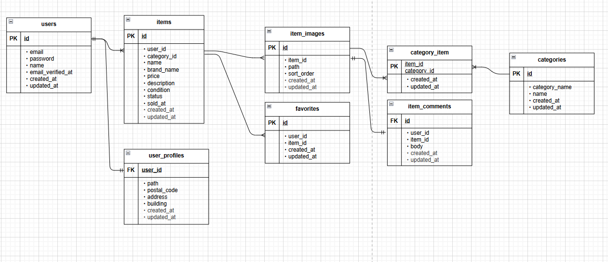

## URL  
・環境開発  
アプリ ： http://localhost  
ログイン画面：  

・phpMyAdmin ： http://localhost:8080/  

## 本アプリはLaravelを使用し、ユーザー認証機能とフリマアプリ機能を備えています。  
以下に動作画面を示します。  

### 1. 商品一覧画面  
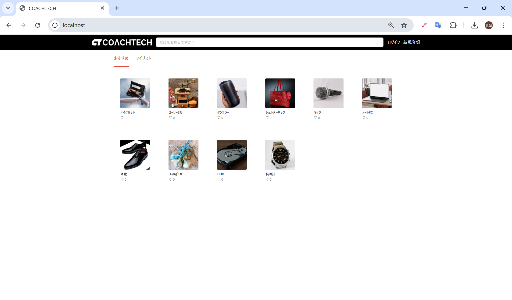  

---

### 2. ログイン画面  
  
※ご自身で登録後ログインしてください。  

---

### 3. 新規登録画面  
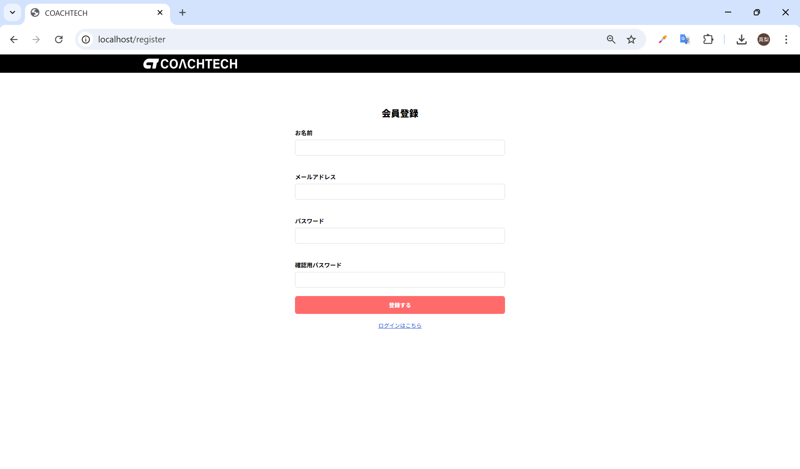  

---

### 4. メール認証画面  
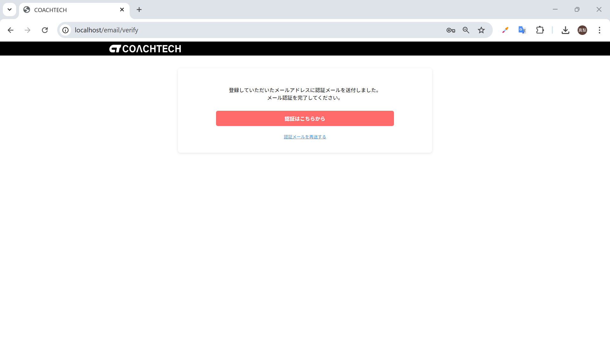  

---

### 5. 商品詳細画面  
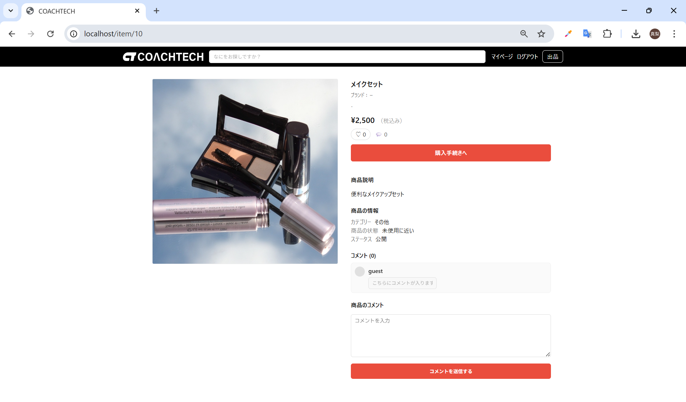  

---

### 6. 出品画面  
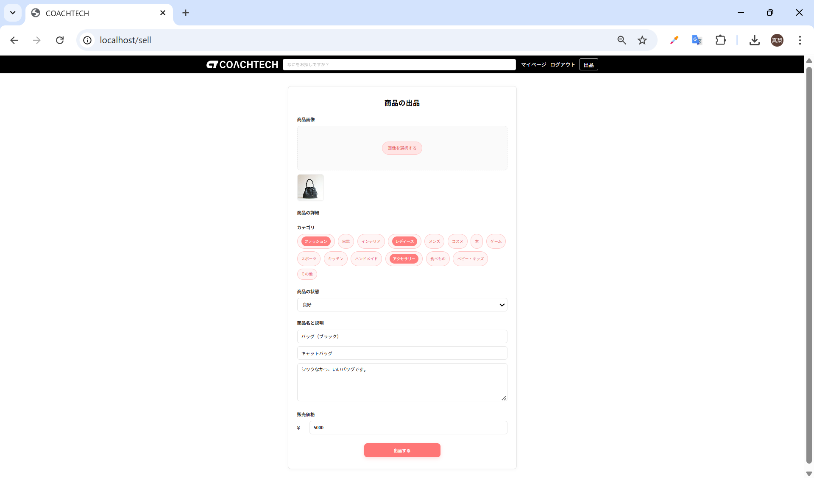  

---

### 7. 出品後画面  
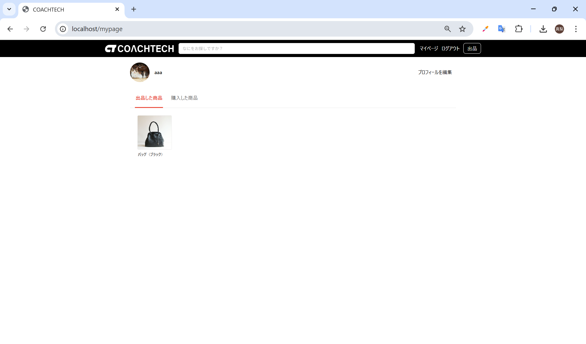  

---

### 8. マイリスト画面  
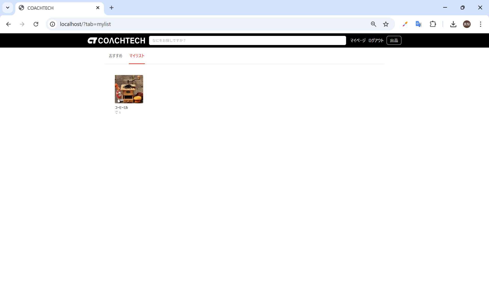  

---

### 9. コメント投稿画面  
  

---

### 10. 購入画面  
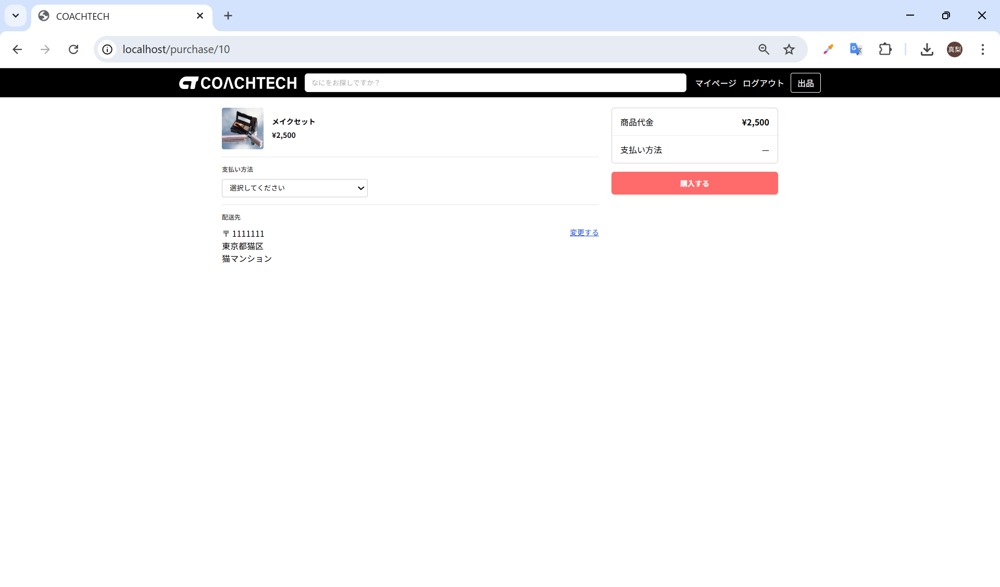  

---

### 11. 送付先住所変更画面  
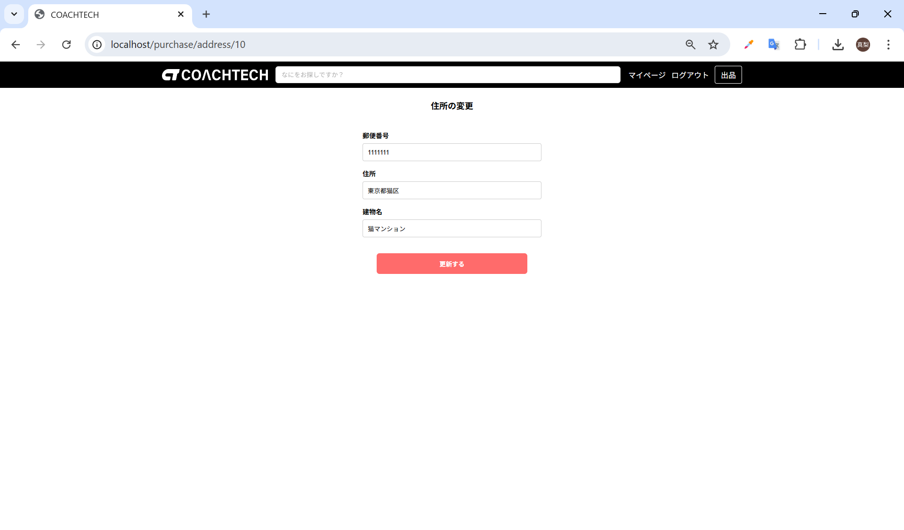  

---

### 12. 購入成功画面  
  

---

### 13. マイページ画面  
  

---

### 14. プロフィール編集画面  
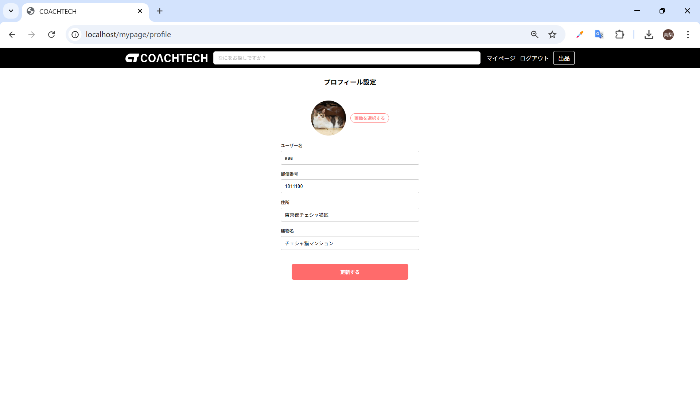  

---

## GitHubリポジトリ  
[こちらをクリックしてコードと動作を確認できます](https://github.com/marionnu/coachtech-freama.git)
